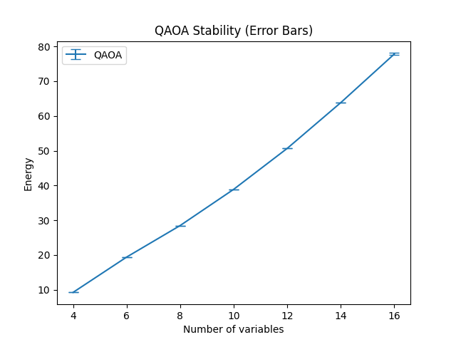

# Hybrid Optimizer Experiments (QAOA vs Classical)

## Overview
This repo compares a classical optimizer against a QAOA-based simulator on a constrained scheduling problem. The goal is simple: see how solution quality and runtime behave as the problem scales.

---

## Results (Visual)

---

## Problem Setup
We assign tasks to slots with constraints, modeled as a QUBO (Quadratic Unconstrained Binary Optimization).

Objective: minimize total cost while satisfying constraints.

---

## Approach

**Classical solver**
- Deterministic
- Serves as the ground truth / baseline

**QAOA simulator**
- Parameterized circuit
- Grid search + multiple restarts
- Evaluated via expectation values

---

## Results

**Solution quality**
- Classical hits the optimum every time
- QAOA is consistently higher (worse)
- Gap grows with problem size

**Stability**
- QAOA variance is very low
- It’s not random — it converges to the same (suboptimal) region

**Runtime scaling**
- Classical grows gradually
- QAOA blows up quickly and becomes impractical

---

## Conclusion
In this setup, QAOA is:
- Stable, but not optimal
- Slower at scale
- Limited by shallow depth + basic parameter search

Takeaway: naive QAOA here doesn’t compete with classical methods.

---

## Files
- `solver_comparison_results.csv` — small-scale comparisons
- `scaling_results.csv` — scaling data
- `plot_results.py` — plotting script
- `runtime_scaling.png` — runtime plot
- `energy_comparison.png` — solution quality plot
- `qaoa_variance.png` — stability (error bars)
