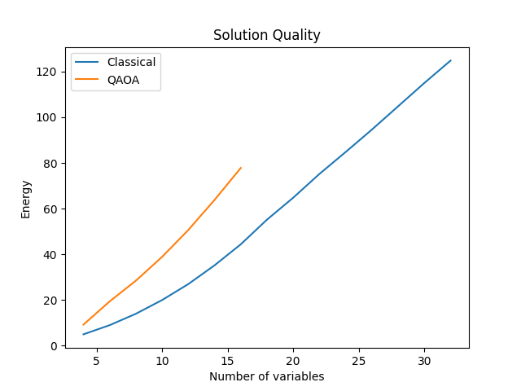
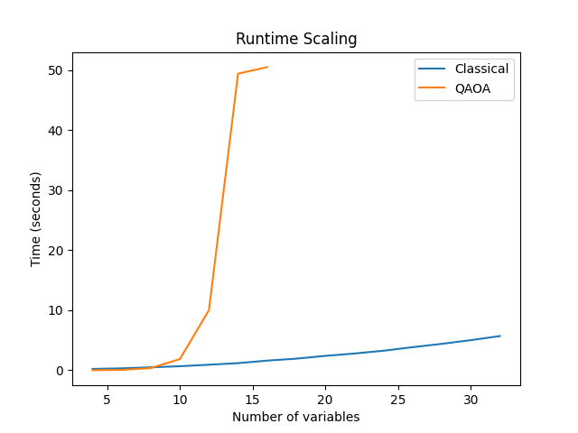

# Experimental Comparison of Simulated Annealing and QAOA on Scheduling Problems

**Author:** Sanjay Shivaganesh  
**Date:** May 2026

---

## Abstract
This work presents an empirical comparison between a classical heuristic optimizer based on simulated annealing and a quantum-inspired approach using a simulated Quantum Approximate Optimization Algorithm (QAOA). Both methods are evaluated on constrained scheduling problems formulated as Quadratic Unconstrained Binary Optimization (QUBO) instances. Experiments analyze runtime scaling, solution quality, and convergence stability across increasing problem sizes. Results show that simulated annealing consistently produces optimal or near-optimal solutions with modest runtime growth, while QAOA simulation exhibits exponential scaling due to full statevector simulation. Although QAOA occasionally produces competitive solutions on smaller benchmark instances, classical optimization remains significantly more practical in this setting.

---

## 1. Introduction
Combinatorial optimization problems such as scheduling are well-known to exhibit significant combinatorial complexity, with many formulations belonging to NP-hard problem classes.

Classical heuristics such as simulated annealing provide practical solutions, but recent interest in quantum algorithms—particularly QAOA—has motivated comparisons between classical and quantum-inspired methods.

QAOA leverages parameterized quantum circuits to approximate optimal solutions, with parameters optimized via classical routines. While full quantum implementations remain limited, classical simulation of QAOA enables controlled benchmarking against established methods. This work investigates whether QAOA-style approaches offer any practical advantage in small-scale scheduling problems.

---

## 2. Problem Formulation
We consider a task-scheduling problem defined as follows:

- Each task must be assigned to exactly one time slot.
- Assignments incur a cost based on a predefined cost matrix.
- Constraint violations are penalized through the objective function.

The problem is encoded as a QUBO of the form:

\[ f(x) = x^T Q x + c \]

where \( x \in \{0,1\}^n \) represents assignment variables and \( Q \) encodes both cost and constraint penalties.

---

## 3. Methods

### 3.1 Classical Solver
The classical baseline uses simulated annealing. Starting from a random binary vector, the algorithm iteratively explores neighboring solutions via single-bit flips. Moves that improve the objective are always accepted, while worse moves are accepted probabilistically based on a temperature schedule. Multiple independent runs are performed, and the best solution is reported.

### 3.2 QAOA Simulation
We implement a classical simulation of a single-layer (p = 1) QAOA circuit. The algorithm prepares a uniform superposition, applies a cost unitary derived from the QUBO, and a mixer unitary, followed by measurement. Parameters (\(\gamma, \beta\)) are optimized using a grid search.

This implementation uses a full statevector representation and therefore scales as \( O(2^n) \), restricting experiments to small problem sizes (n \leq 20).

**Note:** This is a classical simulation of QAOA and does not involve execution on quantum hardware.

---

## 4. Experimental Setup

- Problem sizes range from n = 4 to n = 32 variables for classical optimization, while QAOA simulation is evaluated up to approximately n = 20 due to exponential statevector growth.
- Metrics recorded:
  - Objective value (energy)
  - Runtime
  - Optimality gap (where ground truth is available)
- Classical solver results are averaged over multiple runs (best-of-k selection).
- Results are stored as CSV files for reproducibility.

---

## 5. Results

### 5.1 Solution Quality

*Figure 1. Comparison of solution energies produced by simulated annealing and QAOA simulation across increasing problem sizes.*

The classical solver consistently achieved optimal or near-optimal energies across all benchmark instances. QAOA produced competitive solutions for smaller problems, although solution quality gradually degraded as problem size increased. For example, at n = 10 the classical solver achieved an energy of 20.0 while QAOA produced 38.91. At n = 12, the classical solver produced an energy of 27.0 compared to 50.69 for QAOA simulation.

### 5.2 QAOA Variance

*Figure 2. Variance of QAOA solution energies across repeated optimization runs.*

Variance across QAOA runs remained relatively small despite increasing problem size. Standard deviation values remained below 0.003 for smaller instances and decreased further for larger simulated cases, indicating relatively stable convergence under the fixed grid-search procedure. However, low variance alone did not guarantee high-quality solutions.

### 5.3 Runtime Scaling

*Figure 3. Runtime scaling of simulated annealing and QAOA simulation as the number of variables increases.*

Runtime scaling differed substantially between the two approaches. Simulated annealing runtime increased gradually from approximately 0.23 seconds at n = 4 to 5.70 seconds at n = 32. In contrast, QAOA simulation runtime increased exponentially due to the use of a full statevector representation, growing from 0.014 seconds at n = 4 to over 943 seconds at n = 20. Beyond this point, QAOA simulation became computationally impractical on standard hardware.

---

## 6. Discussion
The experiments highlight a clear trade-off between conceptual novelty and practical performance. Simulated annealing remained computationally efficient across all tested instances and consistently produced optimal or near-optimal solutions. QAOA simulation, while conceptually interesting, incurred substantial computational overhead due to exponential statevector scaling.

QAOA occasionally produced competitive solutions on smaller benchmark instances, suggesting that parameterized quantum-inspired methods may capture useful structure in certain optimization landscapes. However, this behavior was not consistently observed as problem size increased.

Several limitations should also be noted. The experiments were restricted to relatively small benchmark scheduling instances, and the QAOA implementation used only a shallow p = 1 circuit depth. In addition, all quantum experiments were performed through classical simulation rather than execution on physical quantum hardware. As a result, the findings should be interpreted primarily as an exploratory benchmarking study rather than evidence of practical quantum advantage.

---

## 7. Conclusion
This study shows that, for small-scale scheduling problems:

- Classical simulated annealing is reliable and efficient.
- QAOA simulation produces competitive but inconsistent results.
- Exponential scaling limits the practicality of QAOA simulation.

Overall, classical methods remain the preferred approach in this setting, while QAOA serves as a useful framework for exploring quantum-inspired optimization strategies.

---

## 8. Future Work

- Extend QAOA to deeper circuits (p > 1).
- Replace grid search with gradient-based optimization.
- Incorporate realistic noise models.
- Evaluate performance on quantum hardware.

---

## 9. Reproducibility
All experiments, datasets, and plotting scripts are available in the project repository. Results can be reproduced by running the provided experiment scripts in the `engine/experiments` directory.

---

## References

1. Farhi, E., Goldstone, J., & Gutmann, S. (2014). *A Quantum Approximate Optimization Algorithm.* arXiv:1411.4028.

2. Lucas, A. (2014). *Ising formulations of many NP problems.* Frontiers in Physics, 2, 5.

3. Kirkpatrick, S., Gelatt, C. D., & Vecchi, M. P. (1983). *Optimization by Simulated Annealing.* Science, 220(4598), 671–680.
